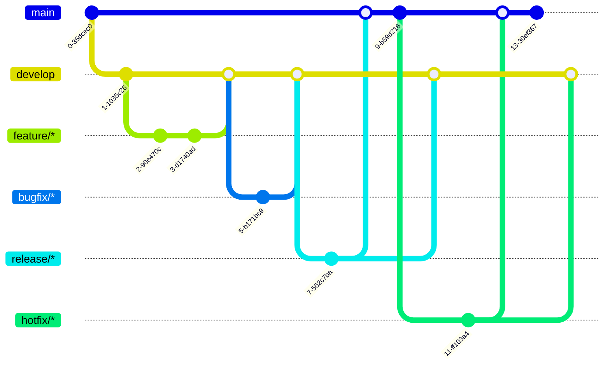

# Branching Strategy and Semantic Versioning

A guide to Git branching strategies, naming conventions, and semantic versioning.

## 1. The Branching Model

The GitFlow model is an established strategy that enables stability and parallel development through a clear separation of branch types. It is suitable for projects with explicit release cycles. The model distinguishes between long-lived and short-lived branches.

### 1.1. Long-Lived Branches

These branches exist permanently in the repository and define the core of the development flow.

| Branch Name | Base Branch | Target Branch | Purpose                                                                                                                 |
| ----------- | ----------- | ------------- | ----------------------------------------------------------------------------------------------------------------------- |
| `main`      | -           | -             | Contains only production-ready code. Every commit is a stable release.                                                  |
| `develop`   | `main`      | -             | Serves as the main integration branch for new features. Completed developments for the next release are collected here. |

### 1.2.Short-Lived Branches

These branches are created for specific tasks and deleted again after their task is completed.

| Prefix      | Base Branch | Target Branch(es)  | Purpose                                                                                      |
| ----------- | ----------- | ------------------ | -------------------------------------------------------------------------------------------- |
| `feature/`  | `develop`   | `develop`          | Development of new functionalities (including unit tests).                                   |
| `bugfix/`   | `develop`   | `develop`          | Fixing bugs that are not critical for production.                                            |
| `hotfix/`   | `main`      | `main` & `develop` | Fixing critical errors in the production version.                                            |
| `release/`  | `develop`   | `main` & `develop` | Preparing a new release (final acceptance tests, documentation, version number adjustments). |
| `refactor/` | `develop`   | `develop`          | Internal code improvements without functional changes.                                       |
| `doc/`      | `develop`   | `develop`          | Additions or changes to the documentation.                                                   |

### 1.3. Visualization of the Workflow

## 2. Conventions for Branch Naming

Consistent naming improves readability, navigation, and automation (CI/CD) of the repository.

- **Use prefixes:** The branch name begins with a prefix that describes its purpose (e.g. `feature/`, `hotfix/`).
- **Short and descriptive:** The name should clearly summarize the content of the changes. Vague names such as `update` should be avoided.
- **Formatting:** Lowercase letters are used. Words are separated by hyphens (`-`). A slash (`/`) separates the prefix from the rest of the name.
- **Include ticket IDs:** The ID of a ticket from the project management tool (e.g. Jira) is included in the name.

**Examples:**

- `feature/JIRA-123-add-user-profile`
- `bugfix/TICKET-45-fix-login-error`

## 3. Semantic Versioning (SemVer)

Semantic Versioning (SemVer) provides a formal standard for naming software versions (e.g. `1.0.0`) consistently. This helps consumers and dependency managers to anticipate the impact of an upgrade.

### 3.1. The Version Format X.Y.Z

A normal version number **MUST** take the format **MAJOR.MINOR.PATCH** (X.Y.Z), where X, Y, and Z are non-negative integers and must not contain leading zeros.

### 3.2. Rules for Incrementing

The version is incremented based on the type of change:

- **MAJOR version (X):** Increased for **incompatible API changes** (breaking changes). This signals that users of the code may need to make adjustments.
  - _Example:_ A function `getUser(id)` is renamed to `fetchUserById(id)`. Existing code calling `getUser(id)` would no longer work. Version changes from `2.5.0` to `3.0.0`.

- **MINOR version (Y):** Increased when **new functionality is added in a backward-compatible manner**. Existing code continues to work without changes.
  - _Example:_ A new export function is added, but all previous functions remain unchanged. Version changes from `2.5.0` to `2.6.0`.

- **PATCH version (Z):** Increased when **backward-compatible bug fixes** are made. No new features are introduced.
  - _Example:_ A typo in an error message is corrected. Version changes from `2.5.0` to `2.5.1`.

The version `0.y.z` is intended for the initial development phase. Version `1.0.0` marks the first stable public release.

## 4. Git Tags for Releases

### 4.1. What Are Git Tags?

A tag is a marker that points to a specific commit in the Git history. In contrast to a branch, which moves forward with new commits, a tag is static and always points to the same commit. It works like a bookmark for an important milestone.

### 4.2. Why Are Tags Used?

Tags are mainly used to mark release points (e.g. `v1.0.0`, `v1.2.1`). This has two advantages:

1. **Easy access:** You can retrieve the exact code state of a specific release at any time without having to search for the commit ID.
2. **Clarity:** Tags make the release history in the repository explicit and traceable.

Tags are usually set on the `main` branch, since every commit there corresponds to a release.

## 5. Practical Example: A Feature Release with Hotfix

1. **Feature development:** A developer creates the branch `feature/JIRA-123-add-user-profile` from `develop`.
2. **Integration:** After completion, the feature branch is merged into `develop`.
3. **Release preparation:** A release branch `release/1.2.0` is created from `develop`. The version number is adjusted within it.
4. **Release:** The `release/1.2.0` branch is merged into `main`. The new commit on `main` is tagged with `v1.2.0`. Afterwards, the changes are merged back into `develop`.
5. **Hotfix:** A critical error is discovered in version `1.2.0`. A hotfix branch `hotfix/security-patch-for-database` is created from `main`.
6. **Hotfix deployment:** After fixing the issue, the hotfix branch is merged into `main` and tagged with `v1.2.1`. The changes are also merged into `develop`.
