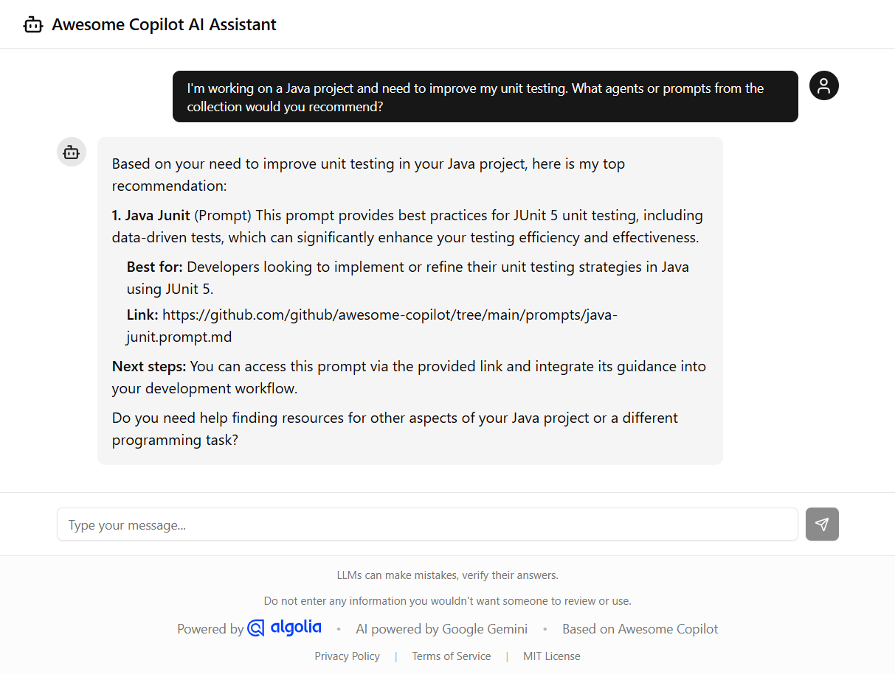

# Awesome Copilot Guide


**What is this?**

Think of this as your personal guide through the [Awesome GitHub Copilot](https://github.com/github/awesome-copilot) ecosystem. Instead of scrolling through hundreds of agents, skills, and prompts trying to find what you need, just tell the chat what you're working on or what tech stack you're using.

**The problem it solves:**

Finding the right Copilot resources shouldn't feel like searching for a needle in a haystack. This tool cuts through the noise by instantly filtering a curated catalog to match your actual workflow.

**How it works:**

Before responding, the AI searches a dedicated Algolia index with the help of Algolia Agent Studio, so you won't find any broken links — only real resources that actually exist. You receive a personalised list of recommendations that fit your specific needs, saving you time and allowing you to get back to coding faster.

## Screenshot



## Tech Stack

- **Framework**: Next.js 16 (App Router)
- **Language**: TypeScript
- **Styling**: Tailwind CSS, Shadcn UI
- **Search & AI**: Algolia Agent Studio with Google Gemini
- **Package Manager**: pnpm

## Prerequisites

- Node.js 20+
- pnpm 10+

## Installation

```bash
pnpm install
```

## Environment Variables

Create a `.env.local` file in the root directory with the following variables:

```env
NEXT_PUBLIC_ALGOLIA_APP_ID=your_app_id
NEXT_PUBLIC_ALGOLIA_API_KEY=your_api_key
NEXT_PUBLIC_AGENT_ID=your_agent_id
```

## Development

Start the development server:

```bash
pnpm dev
```

The application will be available at `http://localhost:3000`.

## Building

Build the application for production:

```bash
pnpm build
```

## Scripts

- `pnpm dev`: Start development server
- `pnpm build`: Build for production
- `pnpm start`: Start production server
- `pnpm lint`: Run ESLint
- `pnpm format`: Format code with Prettier

## Documentation

- [Algolia Configuration](./docs/Algolia.md): Detailed guide on generating the search index, importing data, and configuring the Algolia Agent.
- [Deployment Guide](./docs/Deploy.md): Instructions for configuring GitHub Secrets and deploying the application to GitHub Pages.

## Acknowledgments

- [Awesome Copilot](https://github.com/github/awesome-copilot) by GitHub – The curated list of resources that powers this assistant.
